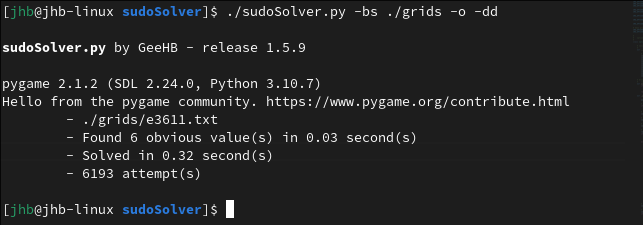
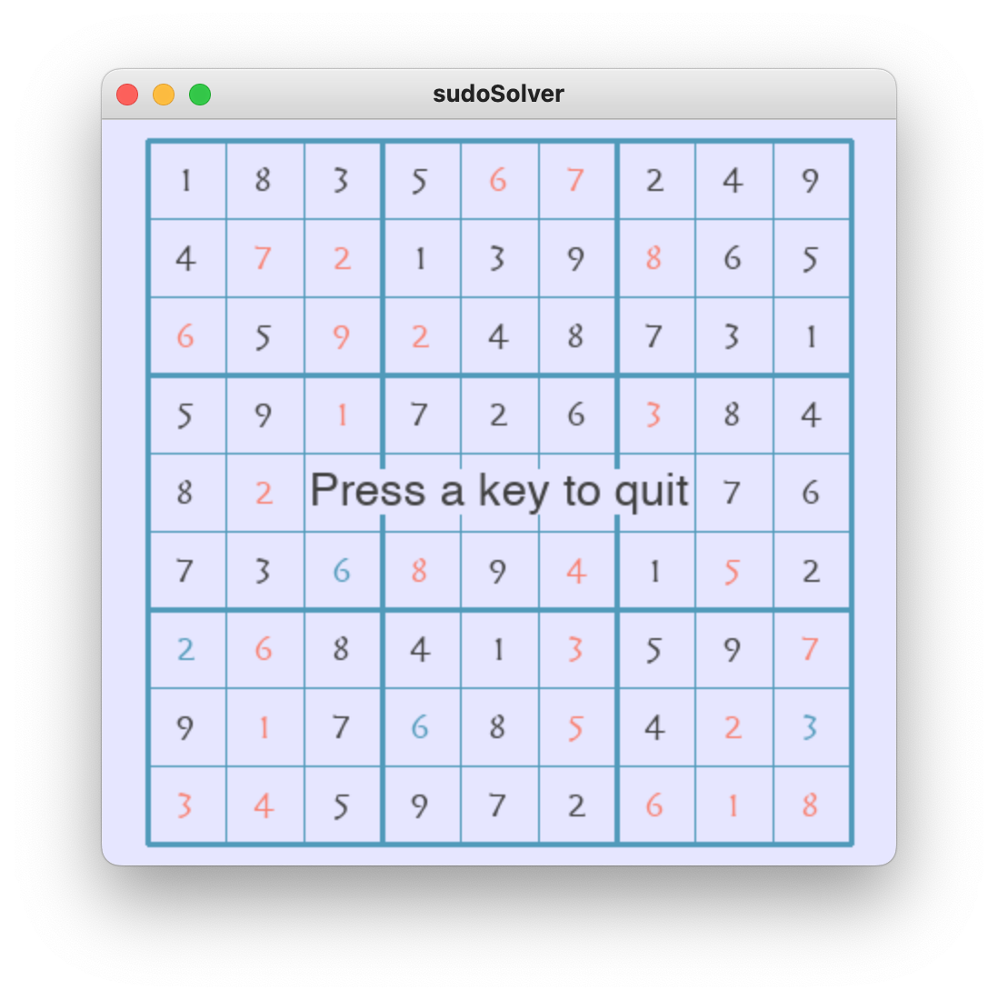

# *sudoSolver* - Edit and solve sudokus

### Presentation

A simple command-line application written in *Python 3* for editing, modifying and solving sudoku.

Solutions are found using a "brute force" algorithm. Some optimisations, searching for obvious values first, can be performed.
During the search process, grids can be displayed in monothreaded mode (very slow) or in a multithreaded way (one thread for computong and a second for drawing operations).

Displays are performed, as desired, on the console or on the *GUI* using *PYGame*. When *nCurses* is available, console displays uses colors.

Sample grids can be found in the *./grid* subfolder.

### Compatibility

Tested on various systems :

| OS | *nCurses* | *PYGame* | Multithreaded |
|----|---------|--------|---------------|
| Windows 10 and higher | no | 2\.1.2 | yes |
| MacOS 12 and higher | no | 2\.1.2 | not functionnal |
| Linux - tested on Fedora 36 / 64bits | 6\.2.9 | 2\.1.2 | yes |

### Command line

*sudoSolver* accepts different parameters :

| **Parameter** | **Description** | Display mode |
|-----------|-------------|--------------|
| *\-b FOLDERNAME* | Browse the folder *FOLDERNAME*. All the grids in the folder will be displayed. | *GUI* only |
| *\-e FILENAME* | Edit the grid saved in *FILENAME*. If the *FILENAME* does not exists, it will be created. | *GUI* only |
| *\-s FILENAME* | Solve the sudoku saved in FILENAME | all |
| *\-bs FOLDERNAME* | Browse the folder *FOLDERNAME* and solve the selected grid. The *left* and *right* arrows allows browsing in the folder. When *enter* key is pressed the selected grid is solved. | *GUI* only |
| *\-es FILENAME* | Edit the grid in *FILENAME* and solve it. If the file does not exist, it will be created. | *GUI* only |
| *\-c* | Force console mode. If *nCurses* is available, the library will be used. | console |
| *\-d* | Display grid during the resolution process. This mode is monothreaded, so very slow. |  |
| *\-dd* | Display grid during the resolution process using a multithreaded algorithm. |  |
| *\-o* | Search *obvious* values before executing brute-force solution searching. | all |
| *\-x* | Save the solution, if any, in a *.solution* file. |  |

::: warn
When the application is called without any parameter, usage screen is displayed.

:::


### Examples

Create (and edit) the *newGrid.txt* file :

```
sudoSolver.py -e newGrid.txt
```

Browse *backup* folder :

```
sudoSolver.py -b backup
```

Edit and solve with opitmisation newGrid.txt and show progression :

```
sudoSolver.py -es newGrid.txt -o -d
```

Solve, in console mode, newGrid.txt :

```
sudoSolver.py -s newGrid.txt -c
```

Browse the backup folder and solve the choosen grid using optimisation and show progress in a multithreaded mode; result must be saved :

sudoSolver.py -bs ./backup -o -dd -x

### Grid edition

::: info
The edition mode is only available with *GUI* displays.

:::

Whether you edit or create a new grid, the editor allow you to fill the grid with the values of your choice.

You can use the defined keys :

| Key | Action |
|-----|--------|
| **←** - Leftwards arrow | Move left |
| **→** - Rightwards arrow | Move right |
| **↓** - Downwards arrow | Move one line up |
| **↑** - Upwards arrow | Move one line down |
| **↡** - Page up | First highest possible value |
| **↟** - Page down | First smallest possible value |
| **↲** - Enter | Stop edition |

::: info
All the keys can be changed. They are defined in the file *pygameOutputs.py*.

:::

### Screenshots

In this screenshot the application displays stats in the console :



*sudoSolver* running on a *MacOS* system :


During edition, the selected box is displayed with a blue background :


In the example the application is called in console mode (-c option) to solve (-s option) the grid named ./grids/f0989.txt :

```
./sudoSolver.py -s ./grids/f0989.txt -c
```

First, the grid is displayed :


Press "enter" and the solution is displayed :


When the application searches for *obvious values*, the values found are displayed using the blue color.

In this sample the application start the edition of a grid : 

  

Then the founded obvious values are displayed : 


And last, the solution is displayed : 

 

### Author

Developped and maintained by Jérôme Henry-Barnaudière / GeeHB - [j.henrybarnaudiere@gmail.com](mailto:j.henrybarnaudiere@gmail.comj.henrybarnaudiere@gmail.com).