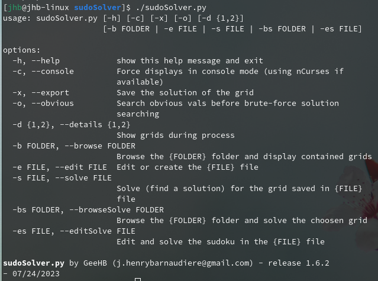

# *sudoSolver*

## 1 - Edit and Solve *Sudokus*
### 1.1 - Presentation

Theses 2 tools allow you to edit, modify and find a solution for any sudoku grid. 

* *sudoSolver.py* is a simple command-line application for editing, modifying and solving sudoku.
* *tksudoSolver.py* use the same 'ngine' as *sudoSolver.py* and display a simple GUI based on *tkInter / TCL-TK*.

For both, solutions are found using a "brute force" algorithm. Some optimisations, searching for obvious values first, can be performed.
During the search process, grids can be displayed in monothreaded mode (very slow) or in a multithreaded way (one thread for computong and a second for drawing operations).

Displays are performed, as desired, on the console or on the *GUI* using *PYGame*. When *nCurses* is available, console displays uses colors.

Sample grids can be found in the *./grid* subfolder.

### 1.2 - Compatibility
Both are 100% written in *Python 3* and have been tested on various systems :

| OS | *nCurses* | *PYGame* | Multithreaded |
|----|---------|--------|---------------|
| Windows 10 and higher | no | 2\.1.2 | yes |
| MacOS 12 and higher | no | 2\.1.2 | not functionnal |
| Linux (Fedora and ChromeOS) | 6\.2.9 | 2\.1.2 | yes |

## 2- *sudoSolver.py* - Command line tool
### 2.1 - Presentation
A simple command-line application written in *Python 3* for editing, modifying and solving sudoku.

Solutions are found using a "brute force" algorithm. Some optimisations, searching for obvious values first, can be performed.
During the search process, grids can be displayed in monothreaded mode (very slow) or in a multithreaded way (one thread for computong and a second for drawing operations).

Displays are performed, as desired, on the console or on the *GUI* using *PYGame*. When *nCurses* is available, console displays uses colors.

Sample grids can be found in the *./grid* subfolder.

### 2.2 - Parameters

*sudoSolver* accepts different parameters :

| **Parameter** | **Long parameter**| **Description** | Display mode |
|-----------|-------------|--------------|--------------|
| *\-b FOLDER* | *--browse FOLDER* | Browse the folder *FOLDER*. All the grids in the folder will be displayed. | *GUI* only |
| *\-e FILENAME* | *--edit FILENAME* | Edit the grid saved in *FILENAME*. If the *FILENAME* does not exists, it will be created. | *GUI* only |
| *\-s FILENAME* | *--solve FILENAME*|Solve the sudoku saved in FILENAME | all |
| *\-bs FOLDER* | *--browseSolve*| Browse the folder *FOLDER* and solve the selected grid. The *left* and *right* arrows allows browsing in the folder. When *enter* key is pressed the selected grid is solved. | *GUI* only |
| *\-es FILENAME* | *--edit FILENAME*|Edit the grid in *FILENAME* and solve it. If the file does not exist, it will be created. | *GUI* only |
| *\-c* | *--console* | Force console mode. If *nCurses* is available, the library will be used. | console |
| *\-d {None, 1,2}* | *--display {None, 1, 2} |  grid during the resolution process. 1 is slow, 2 using a multithreaded algorithm and None (by default) for no drawings. | GUI only |
| *\-o* | *--obvious* | Search *obvious* values before executing brute-force solution searching. | all |
| *\-x* | *--export* | Export the solution, if any, in a *.solution* file. | all |

> :warning:  **Attention** 
> When the application is called without any parameter, usage screen is displayed.



### 2.3 - Examples

Create (and edit) the *newGrid.txt* file :

```
sudoSolver.py -e newGrid.txt
```

Browse *backup* folder :

```
sudoSolver.py -b backup
```

Edit and solve with opitmisation newGrid.txt and show progression :

```
sudoSolver.py -es newGrid.txt -o -d
```

Solve, in console mode, newGrid.txt :

```
sudoSolver.py -s newGrid.txt -c
```

Browse the backup folder and solve the choosen grid using optimisation and show progress in a multithreaded mode; result must be saved :

sudoSolver.py -bs ./backup -o -dd -x

### 2.5 - Grid edition

> *The edition mode is only available with *GUI* displays (TCL/Tk or PYGame).*

Whether you edit or create a new grid, the editor allow you to fill the grid with the values of your choice.

You can use the defined keys :

| Key | Action |
|-----|--------|
| **←** - Leftwards arrow | Move left |
| **→** - Rightwards arrow | Move right |
| **↓** - Downwards arrow | Move one line up |
| **↑** - Upwards arrow | Move one line down |
| **↡** - Page up | First smallest possible value |
| **↟** - Page down | First highest possible value |
| **↲** - Enter | End edition |

> All the keys can be changed. They are defined in the file *pygameOutputs.py*.

### 2.6 - Screenshots

In this screenshot the application displays stats in the console :


*sudoSolver* running on a *MacOS* system :


During edition, the selected box is displayed with a blue background :


In the example the application is called in console mode (-c option) to solve (-s option) the grid named ./grids/f0989.txt :

```
./sudoSolver.py -s ./grids/f0989.txt -c
```

First, the grid is displayed :


Press "enter" and the solution is displayed :


When the application searches for *obvious values*, the values found are displayed using the blue color.

In this sample the application start the edition of a grid : 

 

Then the founded obvious values are displayed : 


And last, the solution is displayed : 


## 3 - *tksudoSolver.py* - *GUI* mode
### 3.1 - Presentation
This *GUI* version of *sudoSolver* works exactly the same as sudoSolver.py. The widgets allow you to access parameters more easily.

 Tab | Button | Action |
|-----|-----|--------|
|Grid| Browse | Choose folder containing grids |
|Grid| << | Previous file in the folder |
|Grid| >> | Next file |
|Grid| Create | Create an empty file |
|Grid| Edit | Edit the current grid |
|Solve| Obvious values | Search for obvious values for the current grid |
|Solve| Solve | Search for a solution |
|Solve| Revert | Return to the original state of the grid, with no obvious value or solution |
|Solve| Save | Save the solution |

Display-mode can be choosen with the combo 'Show progress' :
* *None* - No display while searching a solution
* *Slow* - Single threaded display
* *Multithreaded* - Multi threaded solution : one thread for the search process and a second thread dedicated to displays.

### 3.2 - Screenshots
The "Grid" tab :


The "solve" tab :


Running on ChromeOS :


## 4 - Author
Developped and maintained by Jérôme Henry-Barnaudière / GeeHB - [j.henrybarnaudiere@gmail.com](mailto:j.henrybarnaudiere@gmail.comj.henrybarnaudiere@gmail.com).